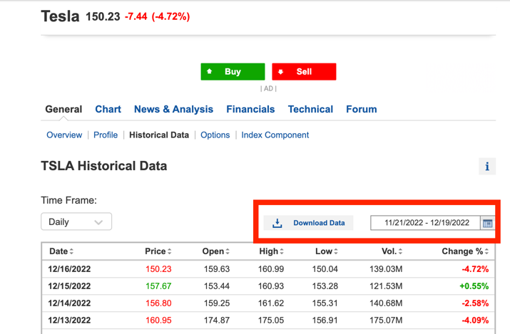
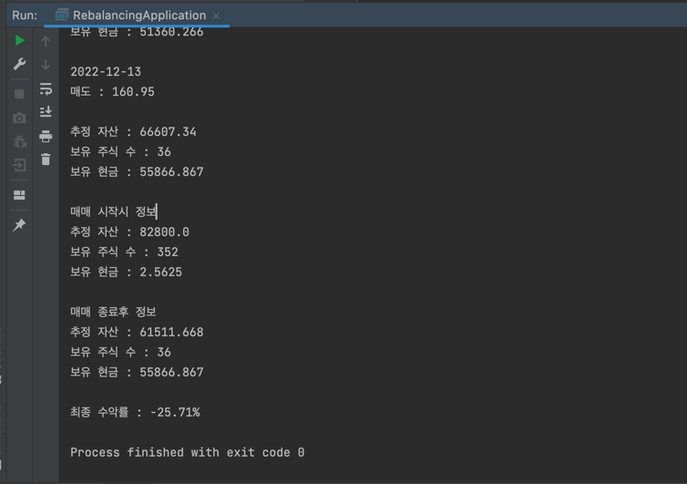

# 리벨런싱 퀀트 모델
* 가격 방어를 위한 퀀트 모델로 주가가 설정한 비율만큼 하락하면 일정 비율을 매도하다가 설정한 비율의 3배가 되면 전량 매수를 한다.
* 주가 하락장에서 수익률을 어느정도 방어하고 보유 주식을 늘리기 위한 모델이다.

## 다음 규칙을 따릅니다.
1. 해당 주식이 고점대비(내 평단가) 설정 비율이상 떨어지면 10% 씩 매도한다.
2. 매도 이후 설정 비율의 3배가 오르면 전량 매수한다.

## 다음을 전제합니다.
1. 시작날짜 전영업일에 전량 매수를 했다고 가정합니다. 
2. 구매 및 판매 가격 기준은 종가를 기준으로 합니다.
3. 매도 / 매수 가격의 변화 비율은 구매시점의 평단가를 기준으로 합니다.
4. 매도량의 대한 기준은 구매 당시의 주식 수의 일정 비율로 합니다.

# 사용법
1. https://www.investing.com/ 에서 계산을 해볼 주식의 주가 정보 csv 를 다운로드 한다.

2. `MainControlller` 에서 `PATH` 에 해당 csv 파일의 절대경로를 넣어준다.
3. `RebalancingController` 에서 시작 날짜와 종료 날짜를 직접 입력하거나 콘솔을 통해 입력한다.
4. 퀀트 모델에 따라 매매시의 최종 수익률을 확인한다. 

## 설정값 수정
* `Constant` 에서 매도, 매수 비율을 수정할 수 있다.
  * `SELL_CHANGE_RATIO` : 매도를 하는 주가 하락 비율
  * `BUY_CHANGE_RATIO` : 매수를 하는 주가 상승 비율 (리벨런싱 모델에서는 `SELL_CHANGE_RATIO` 의 2배수나 3배수로 한다)
  * `SELL_RATIO` : `SELL_CHANGE_RATIO` 비율 하락시 몇 % 의 주식을 매도 할지에 대한 설정값